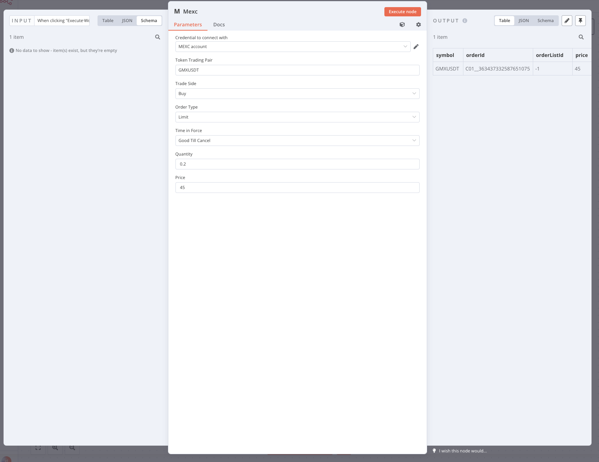
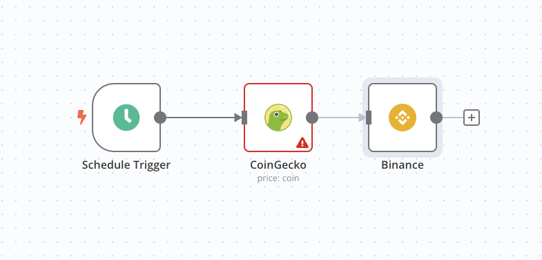

# n8n-nodes-mexc

The `n8n-nodes-mexc` enhances your trading experience on Binance by automating spot trading activities. Utilize your MEXC API key to access a variety of functions such as:

- Limit Orders
- Buy/Sell Operations
- Time-in-Force Options

Incorporate this node into your workflow with caution, considering these crucial points:

- The MEXC API does not permit calls from IP addresses in the US and other restricted countries.
- Your order price must align with the current order book. For instance, placing a $10 buy order for a token trading at $70 is not feasible.
- Decimal pecisions for quantity and price
- Some token pairs may not be available for trading via API.

This MEC plugin empowers you to construct a personalized trading bot. An example use case involves integrating the [Telegram node](https://docs.n8n.io/nodes/n8n-nodes-base.telegram/) to receive price alerts, followed by executing orders through the Binance node.

Furthermore, the plugin supports advanced strategies like TWAP (Time Weighted Average Price) orders and grid trading.

# Install

You can install the community package on the n8n Web GUI, Settings -> Community nodes -> Install a community node, type "n8n-nodes-mexc" in the input box.

You can find deailted installation guide at [n8n website](https://docs.n8n.io/integrations/community-nodes/installation/#install-a-community-node).
